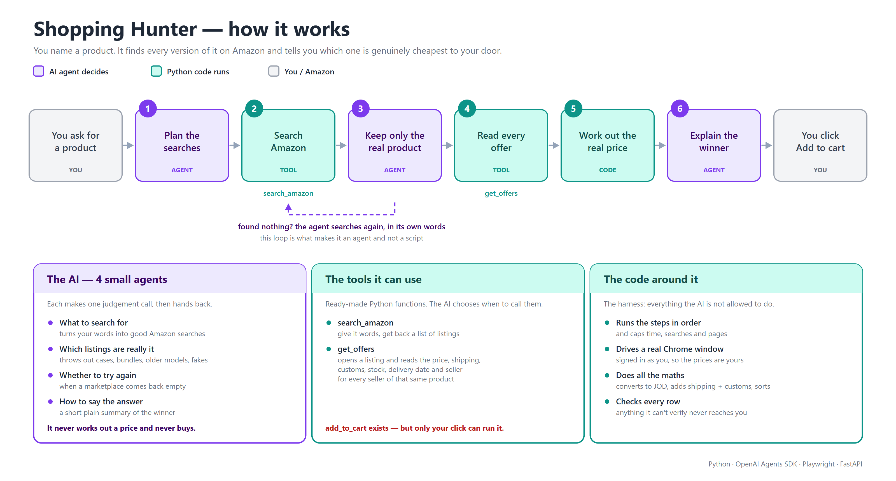

# Shopping Hunter

**An agent that price-hunts one product across three separate Amazon stores at once, and ranks
what it finds by what you will actually pay to get it to your door.**

Amazon.com, Amazon.ae and Amazon.sa are three different shops. Different catalogues, different
sellers, different prices, different currencies (USD, AED, SAR), and different shipping rules to
Jordan. Shopping Hunter searches all three in one run, opens every candidate listing, reads what
Amazon really charges to ship it to you, converts everything to JOD, and gives you one ranked
table. You click **Add to cart**. The AI never touches the cart.

Built on the OpenAI Agents SDK (Python), Playwright and FastAPI. Runs locally.



---

## Why not just use Amazon's search bar?

This is the fair question, and it is the reason the project exists. The search bar answers
*"what does this item cost in this one shop?"*. That is not the question we hade. Our question
was *"of every version of this product, in any of the three Amazons, from any seller, which one is
the best value for for money once it reaches Jordan?"*. Amazon has no screen that answers that.

| What you want | What the search bar gives you |
|---|---|
| One search across .com, .ae and .sa | One store per search. There is no cross-marketplace search. Three tabs, three currencies, manual comparison. |
| The price you actually pay | The sticker price. Shipping and import fees only appear on the product page, one listing at a time, and only after you have set a Jordan address. |
| Sort by total cost to your door | "Price: low to high" sorts by item price. The cheapest item is very often the most expensive to deliver. |
| Every seller of the product | The buy box shows one seller. Others are behind a separate panel, each with their own price, shipping and eligibility. |
| Only the actual product | Results are padded with cases, bundles, older generations and look-alikes that you filter by eye, every single time. |
| Only things that ship to you | Eligibility is per listing and per seller, and is invisible until you open the page. |

### The point, in one real example

From an actual run for `eucerin sunblock`:

| Listing | Item price | Shipping + import to Jordan | Landed cost |
|---|---|---|---|
| Eucerin Daily Hydration Cream, 8 oz | $10.79 | $102.93 | **80.63 JOD** |
| Eucerin Daily Hydration Lotion, 3-pack | $51.82 | $22.98 | **61.52 JOD** |

The item that looks five times cheaper is the more expensive one. Amazon's own sort would put it
first. To find that out by hand you would open both listings, set your address on each, read the
fine print, convert two currencies, and add it up. The hunter does that for every candidate it
finds, across three stores, in one run.

### What a run actually covers

Two verified runs, for scale:

| Run | Marketplaces | Listings found | Inspected | Ranked | Cheapest |
|---|---|---|---|---|---|
| `Logitech MX Master 3S` | amazon.com | 43 (19 after dedup) | 10 | 8 | 78.33 JOD |
| `eucerin sunblock` | all three | 90 (85 after dedup) | 10 | 5 | 61.52 JOD |

Every run reports its own coverage: which stores were searched, which queries were used, how many
listings were skipped and why. A partial run is never presented as a complete one.

---

## Why this is not an MCP server

A reasonable question when you see a set of tools. [Model Context
Protocol](https://modelcontextprotocol.io) lets you publish tools that any AI assistant can call.
The assistant on the other end then becomes the agent.

The two tools here, `search_amazon` and `get_offers`, are already shaped like MCP tools. They take
typed arguments and return compact JSON, never raw HTML. Publishing them would be easy.

**The reason it is not built that way is that the tools are not the valuable part. The loop is.**
Hand the loop to an assistant you do not control and you lose the four things this project is
actually made of:

- **Order.** Search, then judge, then fetch, then score, then check. Python enforces it. A model
  driving the loop can skip a step or call things out of order.
- **Limits.** Caps on searches, pages, browser requests and total run time. Amazon rate-limits and
  blocks. A chatty assistant would hammer it.
- **Correct money.** All arithmetic is `Decimal` in code. Currency conversion, shipping, customs
  and ranking never pass through a language model.
- **The validator.** Every ranked row is re-checked against what was actually fetched, and the
  written summary may only cite listings and prices that exist in that run. This is impossible to
  enforce when someone else's model writes the final text.

The cart matters too. Today no agent has a cart tool, so misuse is architecturally impossible.
Over MCP it would become a tool call behind an approval dialog. Still a safeguard, but a weaker
one.

**Where MCP would fit.** Granularity decides how much survives. Publishing `search_amazon` and
`get_offers` hands over the loop. Publishing a single coarse `hunt_product` tool, which runs this
whole validated pipeline internally and returns the ranked table, keeps every guarantee and still
lets any assistant trigger a hunt. That is a sensible future addition, and it does not replace
anything here.

---

## How it works

```
you ask → plan queries (AI) → search 3 stores (tool) → keep the real product (AI)
→ read every offer (tool) → landed cost + rank (code) → explain (AI)
→ validate (code) → you click Add to cart (revalidated live)
```

- **Four small agents**, each with a strict Pydantic output type: `query_planner`, `matcher`,
  `deep_pass` (the only one with tools) and `summarizer`. Each makes one judgement, then hands back.
- **Everything mechanical is Python**: sequencing, budgets, browsing, money, FX, duties, ranking
  and validation. The model never sees raw HTML and never produces a price.
- **Listing text is untrusted.** Titles and seller names are treated as data to judge, never as
  instructions.
- **Budgets** are enforced in code. Overruns end the run as `partial` with its coverage intact,
  never as a crash.
- **Cart safety**: `POST /cart` takes a single-use server token, re-reads the offer live, checks
  seller, stock and shipping, asks for confirmation if the price rose more than 5 %, adds it, then
  confirms the cart count changed.

---

## Setup (Windows)

```powershell
python -m venv .venv
.\.venv\Scripts\python.exe -m pip install -e ".[dev]"
.\.venv\Scripts\python.exe -m playwright install chromium
copy .env.example .env      # then put your OPENAI_API_KEY in .env
```

Always use the venv. A global pydantic v1 will break the SDK, and startup refuses to run on it.

### Log in to Amazon (once per marketplace)

```powershell
.\.venv\Scripts\python.exe scripts\login.py amazon.com amazon.ae amazon.sa
```

A browser window opens on a **dedicated profile** in `data/profile`. It uses your installed Chrome
as the binary but not your everyday Chrome profile, so logins you already have do **not** carry
over. Sign in there, set your delivery address to Jordan, then press Enter in the terminal. The
app never reads or types credentials. The web UI's **Open login** buttons do the same thing.

Leave that browser window open while the app runs. If it is closed, the session relaunches itself
on the next request.

Browser selection: installed Chrome first, then Edge, then Playwright's bundled Chromium. Pin one
with `HUNTER_BROWSER_CHANNEL`. Managed Windows machines often refuse to execute the bundled
Chromium under `AppData` (`spawn UNKNOWN` / Permission denied), which is why Chrome is preferred.

## Run

```powershell
# offline demo, no API key, fixture data
.\.venv\Scripts\python.exe -m shopping_hunter.cli "Logitech MX Master 3S" --fake

# real browser, deterministic matcher (no API key)
.\.venv\Scripts\python.exe -m shopping_hunter.cli "Logitech MX Master 3S" --fake-llm --marketplaces amazon.com --other-sellers

# full run across all three stores
.\.venv\Scripts\python.exe -m shopping_hunter.cli "Logitech MX Master 3S" --depth thorough

# web UI at http://127.0.0.1:8765  (one worker; it owns the browser profile)
.\.venv\Scripts\python.exe scripts\serve.py     # add --fake-llm / --fake-browser / --headless
```

Tests: `.\.venv\Scripts\python.exe -m pytest`

Regenerate the diagram: `.\.venv\Scripts\python.exe docs\make_diagram.py`

## Configuration (`.env`, prefix `HUNTER_`)

| key | default | meaning |
|---|---|---|
| `HUNTER_MODEL` | `gpt-4.1-mini` | model for all four agents |
| `HUNTER_TRACING` | `false` | Agents SDK tracing (sends prompts and tool IO to OpenAI) |
| `HUNTER_HEADLESS` | `false` | headed is recommended, so you can clear a robot check |
| `HUNTER_BROWSER_CHANNEL` | auto | `chrome`, `msedge`, or blank to auto-detect |
| `HUNTER_COUNTRY` / `HUNTER_CURRENCY` | `JO` / `JOD` | destination |
| `HUNTER_PER_DOMAIN_CONCURRENCY` | `1` | keep low; Amazon rate-limits |
| `HUNTER_MIN_DOMAIN_DELAY_S` / `_MAX_` | `2` / `4` | jittered delay between requests per store |
| `HUNTER_CART_PRICE_CHANGE_THRESHOLD` | `0.05` | ask before adding if the price rose more than this |

## What the numbers mean

- **Import fees** badge: `amazon` means Amazon displayed the figure for that exact offer;
  `amazon derived` means it was shown for the buy box of the same listing and scaled to this
  seller's price; `estimate` means a provisional rules table (`duties.py`, version
  `jo-v1-provisional`) with low confidence. Amazon's own figure always wins when shown.
- Amazon.com often shows one combined "Shipping & Import Charges" line. When the delivery line
  also shows the shipping part, the fee is the difference between them.
- Ratings are product-level and may cover a whole variation family, such as all colours.
- Prices and eligibility are read from product pages and can still change at checkout.

## Known limitations

- Signed out, amazon.ae and amazon.sa do not offer Jordan as a delivery country, so their offers
  come back `location_not_set` and unconfirmed. Signing in with a Jordan address in the address
  book is what makes those two stores useful.
- Amazon changes its markup. Every selector lives in `shopping_hunter/browser/selectors.py`.
- Robot checks are surfaced as `needs_human` for you to clear in the browser window. The app never
  attempts to bypass them. Automation may be restricted by Amazon's terms; keep request rates low.
- The duties table holds placeholder values. Check them against a real customs charge before
  trusting an `estimate` badge.
